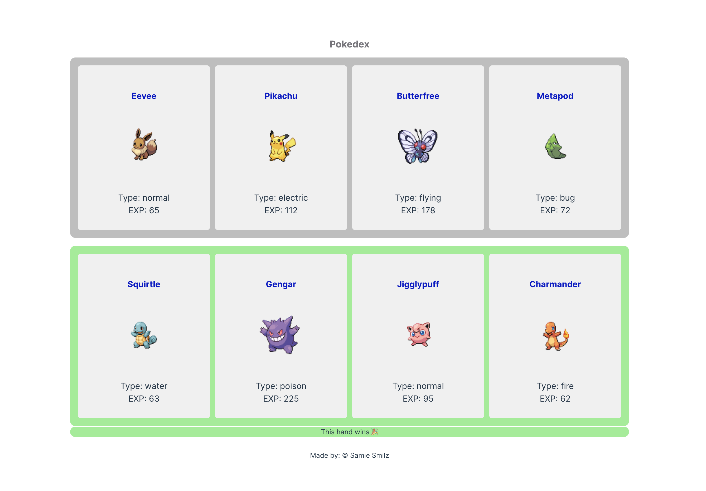

# PokeDex Project

## Overview

Welcome to the PokeDex project! This React-based application provides a fun and interactive way to explore information about various Pokémon. With a simple and user-friendly interface, users can easily browse through Pokémon cards, view their names, images, types, and base experience.

## Functionality

- **App Component**: The top-level container for the PokeDex, rendering a single **Pokedex** component.
- **Pokecard Component**: Displays individual Pokémon cards with name, image, type, and base experience.
- **Pokedex Component**: Renders a sequence of Pokecards based on provided data, utilizing defaultProps for default Pokémon display.
- **Pokegame Component** (Additional Feature): Assigns Pokémon into two hands, determines the winning hand based on total experience, and displays the winning message.
- **Styling**: CSS enhancements for improved visual appeal, including hover effects and transitions.

## Tech Stack

- **React**: Front-end library for building user interfaces efficiently.
- **JavaScript (ES6+)**: Modern JavaScript syntax for writing clean and concise code.
- **CSS**: Styling enhancements for an engaging user experience.

## Get Started

1. Clone the repository to your local machine.
2. Install dependencies with `npm install` or `yarn install`.
3. Run the application using `npm start` or `yarn start`.
4. Explore the PokeDex interface and enjoy discovering different Pokémon!

Feel free to customize and expand upon the project based on your preferences and learning objectives.
Happy exploring!

---
